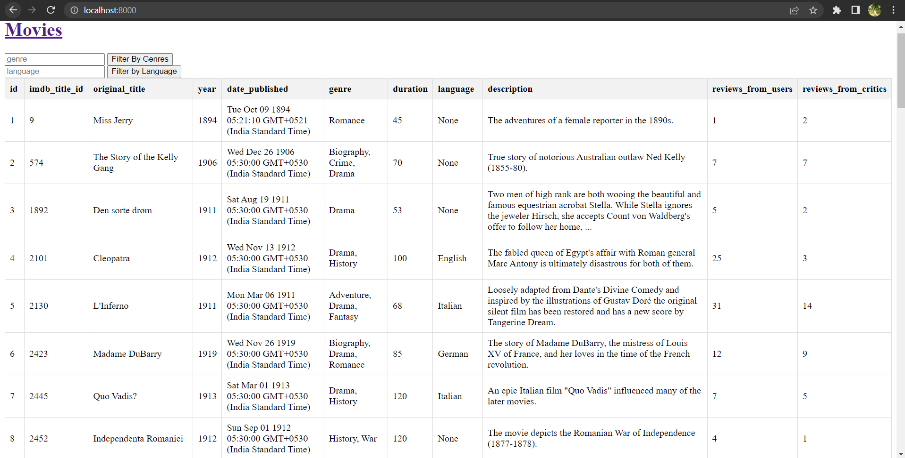
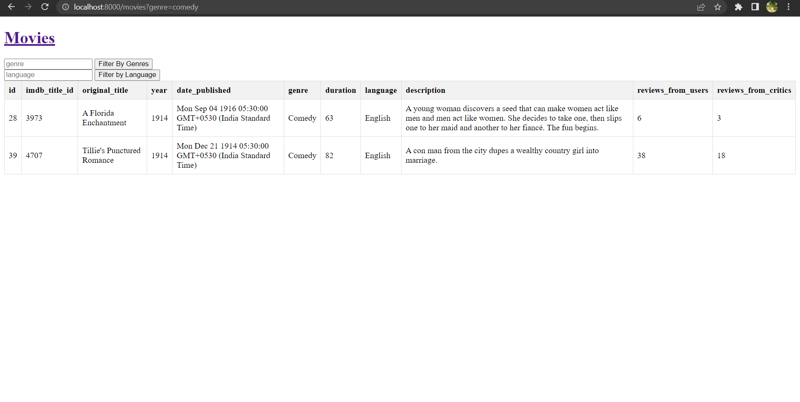
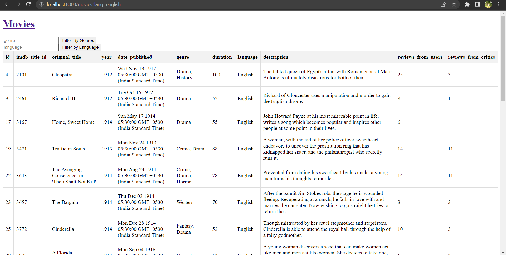

# movies

To set up project locally run `npm install`

Update the env variables for MySql connection.

Run the command `node index.js`

Users can get the details of the movies in tabular form

Users can filter the results based on genre or language

